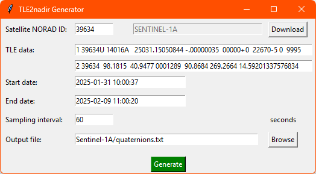
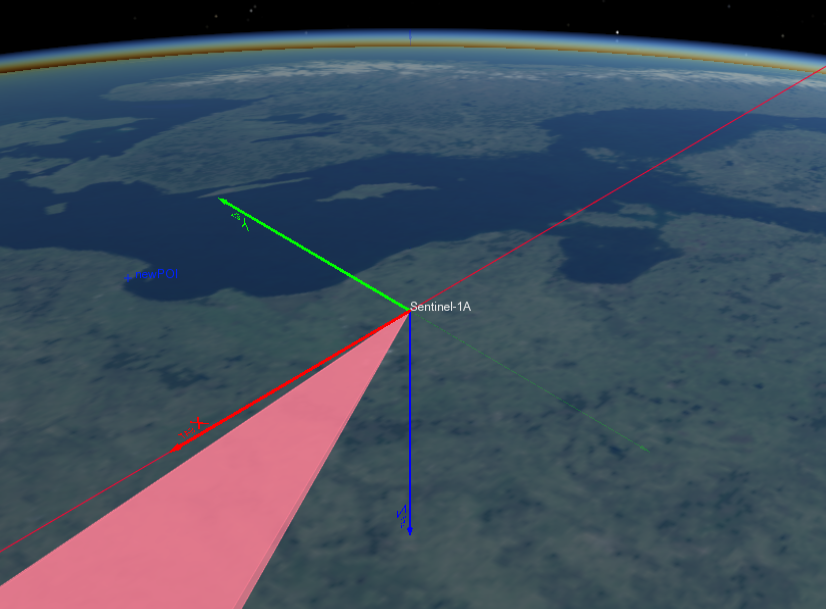

# TLE2nadir

[VTS Timeloop](https://timeloop.fr/vts/) [Generator plugin](https://timeloop.fr/static/doc/manual/pages/Data_generators_in_VTS/index.html) generating Nadir-pointing quaternion from a satellite TLE over a given time period.

